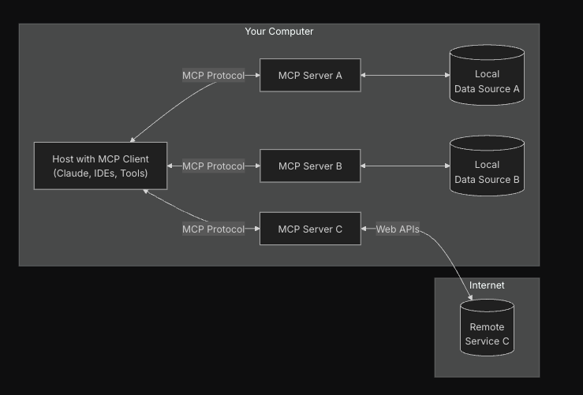

# 什么是Mcp
Model Context Protocol (MCP) 是由 Anthropic 公司推出的一个开放协议，它标准化了应用程序如何向大型语言模型 (LLM) 提供上下文和工具的方式。我们可以将 MCP 理解为 AI 应用的"USB-C 接口"——就像 USB-C 为各种设备提供了标准化的连接方式，MCP 为 AI 模型提供了与不同数据源和工具连接的标准化方式。

让 AI 上下文的知识库中,包含本地的资源,也能够操作本地的一些资源,便于AI更加灵活的帮助用户

MCP 的架构相对简单，主要包含两个核心组件：

MCP 服务器 (Server)：提供工具和资源的服务端，可以使用任何编程语言实现，只要能够通过 stdout/stdin 或 HTTP 通信。
MCP 客户端 (Client)：使用 MCP 服务器提供的工具和资源的 AI 应用，如 Claude Desktop、Cursor 编辑器等。
MCP 服务器向客户端提供两种主要能力：

工具 (Tools)：可执行的函数，允许 AI 执行特定操作
资源 (Resources)：提供给 AI 的上下文信息，如文件内容、数据库结构等