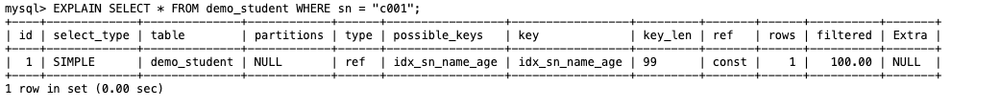
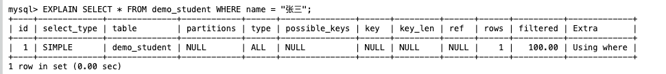
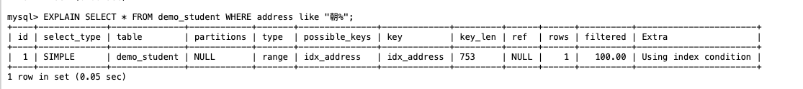
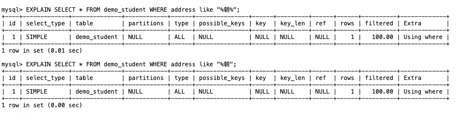
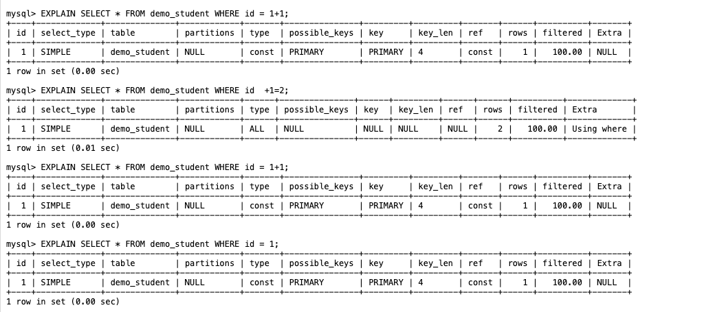
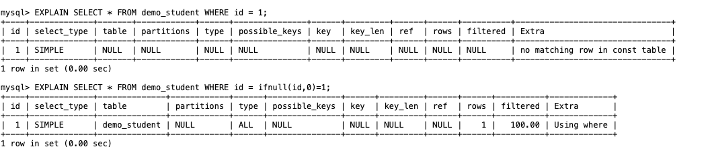
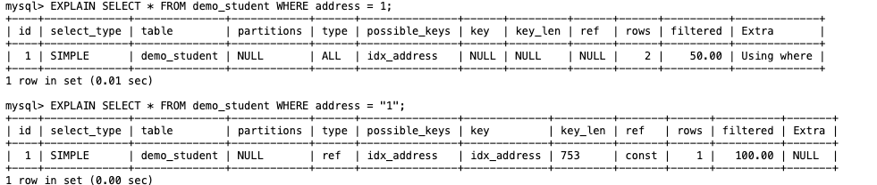
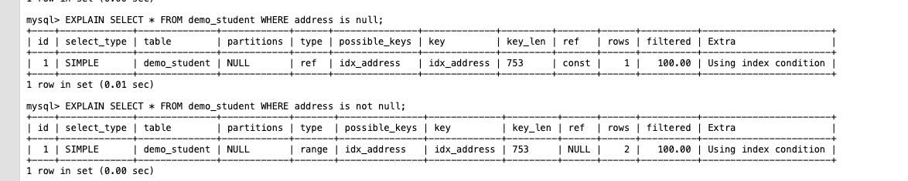
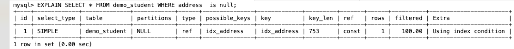
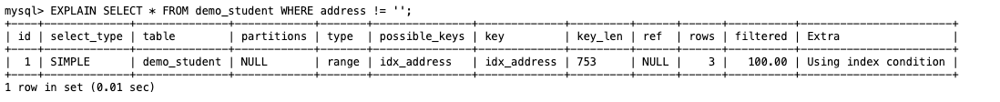

# 索引失效的常见情况
## 举例数据
```
drop table if exists demo;
create table demo_student(
  id int primary key auto_increment comment '主键',
  sn varchar(32) comment '学号',
  name varchar(250) comment '姓名',
  age int comment '年龄',
  sex bit comment '性别',
  address varchar(250) comment '家庭地址',
  key idx_address (address),
  key idx_sn_name_age (sn,name,age)
)ENGINE=InnoDB DEFAULT CHARSET=utf8;
-- 添加测试数据
insert into demo_student(id,sn,name,age,sex,address) 
  values(1,'s001','张三',18,1,'朝阳'),
  (2,'s002','李四',20,0,'丰台'),
```


1. 联合索引不满足最左匹配原则。
**举例**
- 使用联合索引存在最左时命中索引

- 使用联合索引不存在最左时未命中索引

2. 模糊查询最前面的为不确定匹配字符。
- 使用模糊查询通配符[%]不在最前,命中索引

- 使用模糊查询通配符[%]在最前,未命中索引

3. 索引列参与了运算。

4. 索引列使用了函数。

5. 索引列存在类型转换。


## 辟谣不能走索引的情况
此种情况不是不能走索引,而是会通过索引优化器进行评估,判断是否使用索引.

1. 索引列使用 is not null 查询。 **谣言可以走索引**

2. 索引列使用 is null 查询

3. 索引列使用 != 查询
